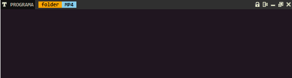

# MiVentana
creado con tkinter para reemplazar la ventana por defecto

## Caracteristicas basicas

- click derecho (presionando): para mover ventana
- esquinas inferiores (presionando): para redimensionar la ventana
- La ventana tiene los botones basicos cerrar, maximizar, minimizar
- Adema de los botones de mantener en top, alinear a los lados
- En el nombre del programa tiene un menu
